# 画面遷移図

アプリ全体の画面と、画面どうしの行き来を示す。各画面の表示項目・入力チェック・エラー文言は、機能ごとの基本設計書に書く。

## 1. 全体のナビゲーション

- 画面下部に **3 つのタブ**を常に置き、「常備食」「買い物」「消費済」を 1 タップで行き来できるようにすること。
- タブのラベルは短くすること。「買い物リスト」は「買い物」、「消費済リスト」は「消費済」と表示すること。画面の見出しでは正式な名前を使うこと。
- 保存区分の絞り込み（すべて / 冷蔵 / 冷凍 / 常温）は常備食リストの上部に置き、下部タブとは別のものとして扱うこと。上部にタブ行を 2 段重ねないこと。
- メンバー・通知の設定・アカウントの設定は、ヘッダーのメニューから開くこと。メニューは 3 つのタブすべてのヘッダーに置くこと。
- 右下の丸い追加ボタンは下部タブに重ならない位置に置くこと。

## 2. 画面の一覧

| 画面 | 機能 | 開き方 |
| --- | --- | --- |
| ログイン | 認証と家族グループ | アプリを開いたとき、ログインしていない場合 |
| 家族グループの選択 | 認証と家族グループ | ログイン後、どの家族グループにも所属していない場合 |
| 家族グループをつくる | 認証と家族グループ | 家族グループの選択から |
| 招待コードで参加する | 認証と家族グループ | 家族グループの選択から |
| 常備食リスト | 常備食管理 | 下部タブ（アプリの入口となる画面） |
| 常備食の詳細 | 常備食管理 | 常備食リストのカードを押す |
| 常備食の登録・編集 | 常備食管理 | 常備食リストの追加ボタン、詳細の編集、消費済リストから常備食へ戻す |
| 消費済リスト | 常備食管理 | 下部タブ |
| 買い物リスト | 買い物リスト | 下部タブ |
| メンバーと家族グループ | 認証と家族グループ | ヘッダーのメニュー |
| 招待コードの発行 | 認証と家族グループ | メンバーと家族グループから |
| 通知の設定 | 期限通知 | ヘッダーのメニュー |
| アカウントの設定 | 認証と家族グループ | ヘッダーのメニュー |

## 3. 図01 全体の画面遷移



> 図のソースは [`画面遷移図.01.mmd`](./画面遷移図.01.mmd)（mermaid）。編集後は次で再生成する（プロジェクトのルートフォルダで実行。要 Docker Desktop 起動）:
>
> ```powershell
> docker run --rm -v ${PWD}:/data minlag/mermaid-cli:11.12.0 -i docs/specs/02_basic-design/画面遷移図.01.mmd -o docs/specs/02_basic-design/画面遷移図.01.svg
> ```

線の読み方は次のとおり。

- **実線** … 画面が移る操作。
- **点線** … 画面が移らず、データだけが動く操作。削除と、買い物リストへの追加がこれにあたる。
- 「下部タブの3画面」の枠の中で結ばれている 3 つは、下部タブで互いに行き来できること。

図に描いていない共通の決まりは次のとおり。

- 子画面（詳細・登録編集・メニューから開く各画面）からは、いつでも元の画面へ戻れること。戻る操作は図では省略している。
- 常備食リスト・買い物リストは、画面を開いたときと引き下げ操作をしたときに再読込すること。開いたまま自動で更新し続けないこと。
- 家族グループに所属していない利用者を、常備食リストより先へ進ませないこと。
- プッシュ通知を押した場合は、期限が近い食品に絞り込んだ状態の常備食リストを開くこと。
- 常備食リストのカードのカート、または詳細から買い物リストへ商品を追加したときは、画面を移さずその場にとどまること。追加したことは画面下部の短い帯で伝えること。
- 一覧のカードのゴミ箱から削除したときは、確認したうえで画面を移さず一覧にとどまること。買い物リストで商品を削除したときも同じとすること。
- 消費済リストからは、常備食へ戻す操作（登録・編集画面が開く）と、買い物リストへ追加する操作（画面は移らない）の 2 つを提供すること。消費済リストに削除の操作は置かないこと。

## 4. 図02 消費済と購入済みの分岐

残数が 0 になったときと、買い物リストで購入済みにしたときは、画面を移さずシートを出して選ばせる。選んだ結果によってデータの行き先が変わる。



> 図のソースは [`画面遷移図.02.mmd`](./画面遷移図.02.mmd)（mermaid）。編集後は次で再生成する（プロジェクトのルートフォルダで実行。要 Docker Desktop 起動）:
>
> ```powershell
> docker run --rm -v ${PWD}:/data minlag/mermaid-cli:11.12.0 -i docs/specs/02_basic-design/画面遷移図.02.mmd -o docs/specs/02_basic-design/画面遷移図.02.svg
> ```

## 5. 削除と消費済の違い

一覧から食品が消える経路は 2 つある。混同しないこと。

| | 消費済 | 削除 |
| --- | --- | --- |
| 入口 | 一覧または詳細で残数を 0 にしたときのシート | 一覧のカードのゴミ箱、または詳細画面 |
| 意味 | 食べ終えた | 登録そのものを取り消す |
| 確認 | シートで 3 つから選ばせる | 削除前に確認ダイアログを出すこと |
| 取り消し | 提供しない | 削除直後に「元に戻す」を 5 秒程度表示すること |
| 消費済リスト | 表示する | 表示しないこと |
| データ | 残すこと | 残すこと |

一覧のゴミ箱は、押し間違いを避けるため次のとおり置くこと。

- 常備食リストでは、食品名と同じ行の右端にカート・ゴミ箱の順で置き、残数の増減ボタンは同じカードの下段の右に置くこと。
- 買い物リストでは、チェックを行の左端、ゴミ箱を右端に置くこと。
- ゴミ箱のアイコンを赤で塗らないこと。赤は確認ダイアログの「削除する」にだけ使うこと。

確認ダイアログに表示する文言は次のとおりとすること。〇〇には食品名または商品名を入れる。

| 削除するもの | 見出し | 本文 | ボタン |
| --- | --- | --- | --- |
| 常備食 | 「〇〇」を削除しますか | 一覧から消えます。消費済リストにも残りません。食べ終えた場合は、削除ではなく残数を0にしてください。 | キャンセル / 削除する |
| 買い物リストの商品 | 「〇〇」を削除しますか | 買い物リストから消えます。常備食には何もしません。 | キャンセル / 削除する |

## 6. 参照

- [常備食管理の要件](../01_requirements/20_常備食管理/01_常備食管理.md)
- [買い物リストの要件](../01_requirements/30_買い物リスト/01_買い物リスト.md)
- [認証と家族グループの要件](../01_requirements/10_認証と家族グループ/01_認証と家族グループ.md)
- [期限通知の要件](../01_requirements/40_期限通知/01_期限通知.md)
- [図の作成・更新手順](../../diagrams.md)
